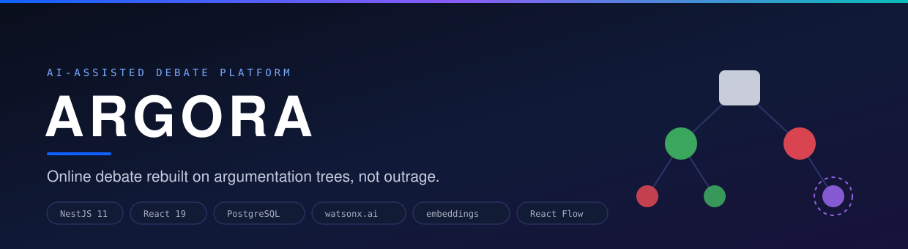
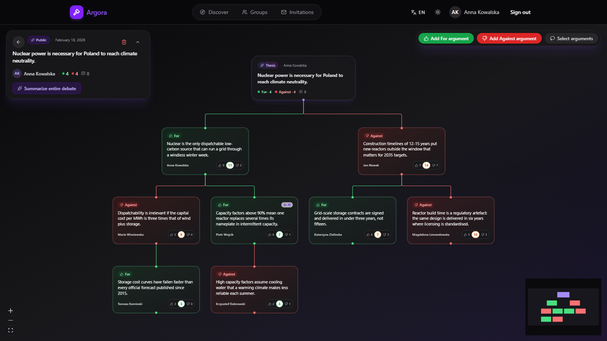
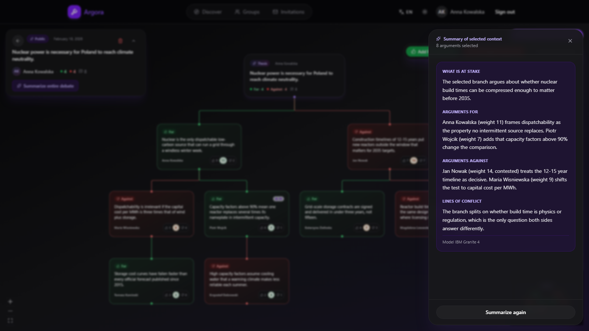
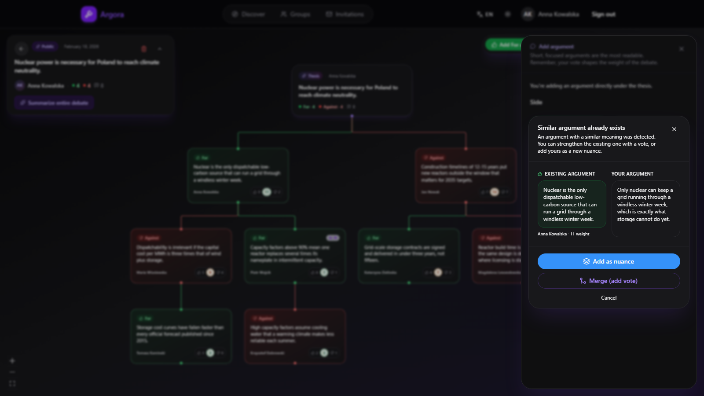
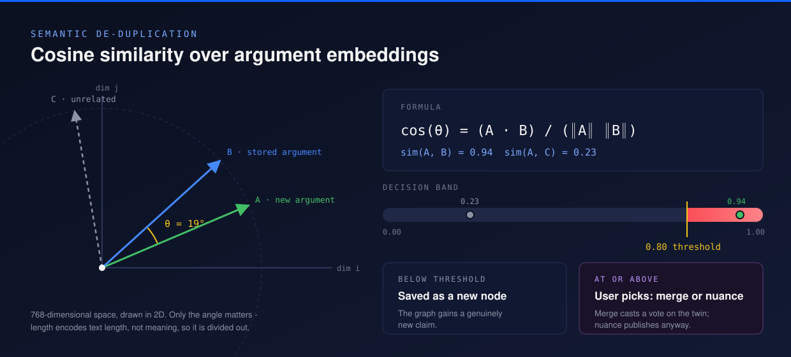
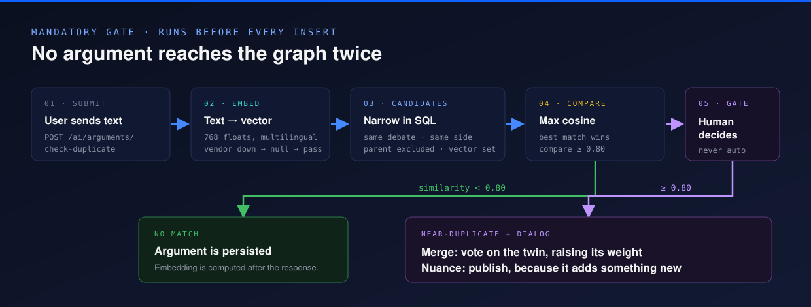
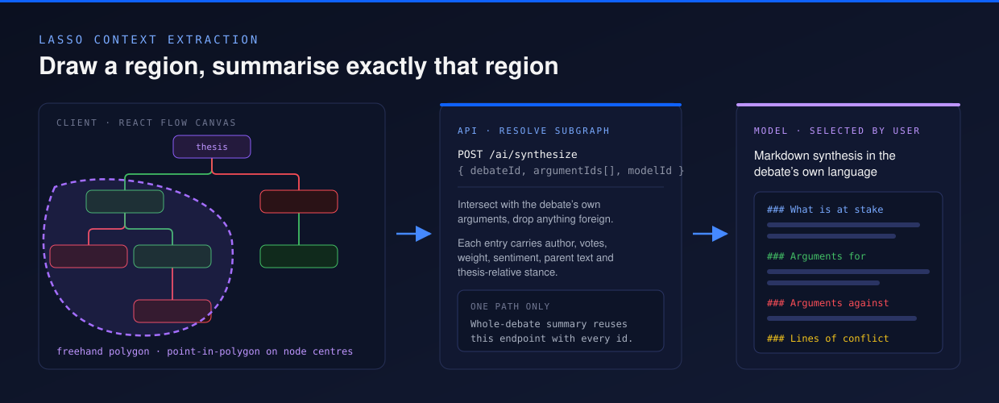
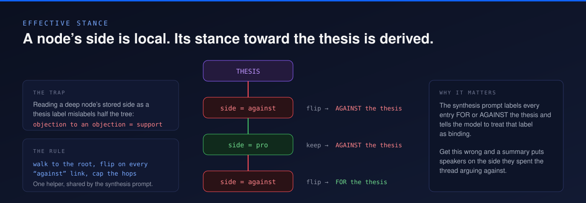
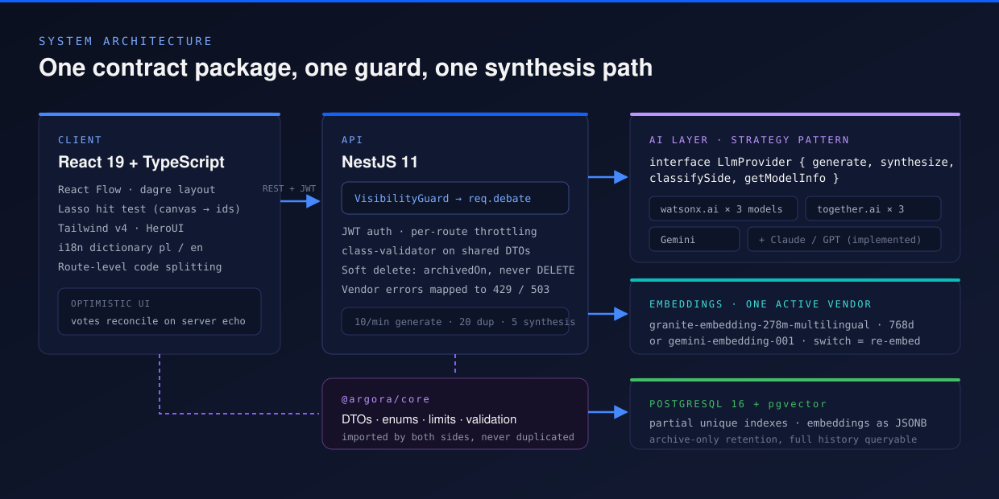
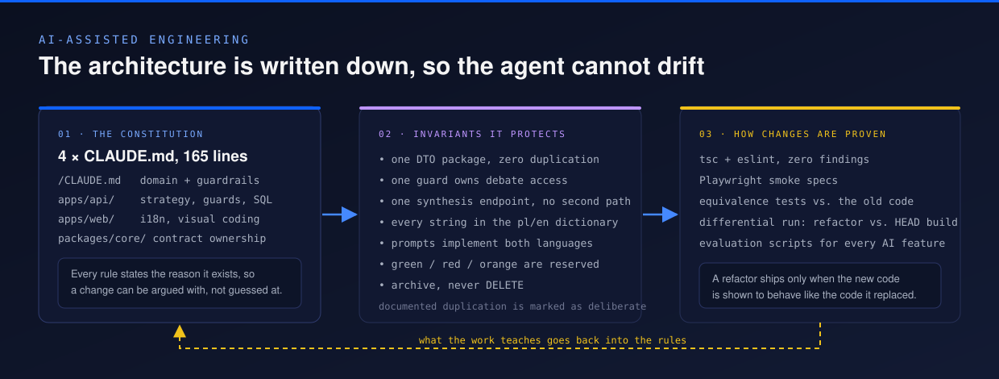

<p align="center">
  
</p>

<p align="center">
  
  
  
  
  
  
  
</p>

<p align="center">
  <a href="https://youtu.be/Fgw38GYoWFg"><b>Video walkthrough</b></a> &nbsp;·&nbsp;
  <a href="#how-the-ai-works"><b>How the AI works</b></a> &nbsp;·&nbsp;
  <a href="#architecture"><b>Architecture</b></a> &nbsp;·&nbsp;
  <a href="#built-with-an-ai-pair-programmer"><b>AI-assisted engineering</b></a> &nbsp;·&nbsp;
  <a href="#run-it-locally"><b>Run it locally</b></a>
</p>

---

## The problem this solves

A comment thread is a **timeline**. It rewards whoever posts loudest and most often, it forgets what was already said, and after two hundred replies nobody can tell you what the disagreement actually is.

Argora replaces the timeline with a **tree**. Every claim attaches to the claim it answers, so the shape of the discussion carries meaning: a deep branch marks the real axis of conflict, a missing child marks an objection nobody answered. On top of that structure sit three AI capabilities: semantic de-duplication, region-scoped synthesis, and context-aware generation.

Generated text is always a proposal: a person edits, rejects or accepts it before anything is written to the graph.

> Built as the engineering artefact of an MSc thesis, and presented at the **IBM Innovation Project - Country Challenge 2026**. A [video walkthrough](https://youtu.be/Fgw38GYoWFg) shows the running application end to end.

---

## See it

<p align="center">
  
</p>

<table>
<tr>
<td width="50%"></td>
<td width="50%"></td>
</tr>
<tr>
<td><b>Lasso &rarr; synthesis.</b> Circle any region of the graph; the model summarises exactly those nodes.</td>
<td><b>Duplicate gate.</b> A near-identical claim is caught before it is written, and the author chooses what happens.</td>
</tr>
</table>

---

## How the AI works

### 1. Semantic de-duplication

Two people routinely submit the same claim in different words, and keyword matching cannot catch it: _"commuting eats hours of my week"_ and _"remote work gives people their time back"_ share no words and mean the same thing.

Every argument is embedded into a multilingual vector, and closeness is measured as the **cosine of the angle** between vectors - magnitude tracks text length, which is not meaning, so it is divided out.

<p align="center">
  
</p>

```ts
// apps/api/src/ai/embedding.service.ts
cosineSimilarity(a: number[], b: number[]): number {
  let dot = 0, normA = 0, normB = 0;
  for (let i = 0; i < a.length; i++) {
    dot += a[i] * b[i];
    normA += a[i] * a[i];
    normB += b[i] * b[i];
  }
  if (normA === 0 || normB === 0) return 0;
  return dot / (Math.sqrt(normA) * Math.sqrt(normB));
}
```

The threshold is **0.80**, not the rounder 0.75: a sweep reported in the thesis found 0.80 the lowest cut that keeps recall at 1.00 while sharply cutting false positives. It stays overridable through `DUPLICATE_THRESHOLD`, because the right value depends on the embedding model.

<p align="center">
  
</p>

Beyond the formula:

- **The comparison set is narrowed in SQL**, not in memory: same debate, same stored side, embedding present, and the parent excluded - a reply naturally echoes the wording of what it answers, so comparing against it would flag every rebuttal.
- **A dead embedding vendor must not block a user.** `EmbeddingService.embed` returns `null` on failure and the gate degrades to "no similarity found".
- **The gate never decides.** Above the threshold the user is shown both texts and picks: _merge_ casts a vote that raises the existing argument's weight, _nuance_ publishes anyway.
- **Embeddings are computed after the response.** The write path stays fast; the vector lands asynchronously.

### 2. Lasso context extraction

A whole-debate summary flattens every branch into one answer, and the question is often about a single branch.

<p align="center">
  
</p>

The hit test runs on the client against React Flow canvas coordinates; the API receives **ids only** and intersects them with the debate's own arguments, dropping anything foreign. Each selected node is handed to the model with its author, vote counts, weight, sentiment, parent text and thesis-relative stance - so the parent-child relations survive without nesting the prompt.

Whole-debate summarisation is the same endpoint with every id passed in. One synthesis path, no second implementation to drift.

### 3. Generation, and the stance problem

Generated text arrives as a **proposal in the textarea**, badged as model output only when it really came from a model, and that badge is cleared the moment the argument is sent. Before publishing, a second model call checks the argument against the side the author picked and offers a switch if they disagree - and when every provider fails, the submission proceeds rather than blocking.

What "side" means here is not obvious:

<p align="center">
  
</p>

A node's stored `side` is relative to its **immediate parent**. Read it as a thesis label and an objection to an objection gets filed as opposition to the thesis - which would put speakers on the side they spent the whole thread arguing against. One helper walks the parent chain and flips polarity on every _against_ link; the synthesis prompt uses it and tells the model the resulting label is binding.

---

## Architecture

<p align="center">
  
</p>

### Design decisions

| Decision                                                | Why it is this way                                                                                                                                                                                                                                      |
| ------------------------------------------------------- | ------------------------------------------------------------------------------------------------------------------------------------------------------------------------------------------------------------------------------------------------------- |
| **Contracts live in `@argora/core`**                | Every DTO, enum and limit is declared once and imported by both sides. The argument length bounds are exported constants, so the form check, the server validator and the error copy cannot disagree.                                                   |
| **One `VisibilityGuard` for every debate-scoped route** | It resolves the debate from the route param, from an `:argumentId`, or from the request body, then attaches the row. Services read `req.debate` instead of re-fetching and re-checking - a second copy of an access rule is how two copies drift apart. |
| **Provider-agnostic AI layer**                          | One `LlmProvider` interface, one class per vendor. The registry instantiates whatever the environment has credentials for, so an empty registry is a valid boot state and the AI features simply go quiet.                                              |
| **Embeddings are a single active vendor**               | Vectors from different models are not comparable, so this is a process-wide choice rather than a per-request one. Switching means re-embedding the corpus, and there is a script for exactly that.                                                      |
| **Archive, never delete**                               | Every table carries `archivedOn`. Reads go through one `activeWhere` helper; archiving cascades to child rows inside one transaction. The full history stays queryable for analysis.                                                                    |
| **Two partial unique indexes in raw SQL**               | "One pending invitation per pair" and "one active vote per pair" are conditional constraints. TypeORM cannot express them, so they live in `db/init.sql` where the database enforces them.                                                              |
| **Per-route rate limits**                               | Each AI route owns one named throttle bucket and explicitly skips the other three, because a shared guard otherwise applies the strictest limit everywhere.                                                                                             |
| **Vendor errors never surface raw**                     | Every provider call funnels through one wrapper that maps throttling to 429 and anything else to 503, with a user-facing message instead of an SDK string.                                                                                              |
| **The debate's language, not the reader's**             | A generated premise is persisted as a node, so it must match the tree it joins. Prompt builders take the debate's language and a missing variant is a compile error, not a silent fallback.                                                             |

### Interface, in two languages

Every user-visible string - 286 keys - lives in one dictionary that declares the contract once and implements it for Polish and English independently, so a missing translation fails the type check instead of silently falling back. Pro/against/controversy colours are reserved tokens: green, red, and orange used for nothing else.

---

## Built with an AI pair-programmer

<p align="center">
  
</p>

The code is written with [Claude Code](https://claude.com/claude-code). Four `CLAUDE.md` files act as a machine-readable architecture document: the root one owns the domain rules and guardrails, and each workspace adds its own. They are not style notes. They are the invariants that keep an agent - or a new contributor - from quietly re-implementing something that already exists:

- contracts belong to `@argora/core`, never duplicated across apps;
- one guard owns debate access, and no service re-checks membership inline;
- the lasso and the whole-debate summary share one endpoint;
- every user-visible string goes through the dictionary, in both locales;
- orange means "controversy" and nothing else.

Every rule records **why** it exists, so it can be challenged on its reason rather than followed blindly. The one deliberate duplication in the codebase - a sentiment constant mirrored on the client for optimistic UI - is documented as deliberate, in both places.

The last refactor pass was accepted only after the new code was shown to behave like the code it replaced: property-based equivalence tests against the pre-refactor implementations, and a differential run of the refactored build against a build of `HEAD` comparing rendered layout and feature output side by side.

---

## Evaluation

The AI features are measured, not asserted. `scripts/` holds the evaluation harness used for the thesis chapter:

| Script                         | What it measures                                                                                                |
| ------------------------------ | --------------------------------------------------------------------------------------------------------------- |
| `eval-duplicate-detection.mjs` | Threshold sweep for cosine similarity against a labelled set, with a lexical (Jaccard) baseline for comparison. |
| `eval-model-comparison.mjs`    | Generation quality and side-classification accuracy across registry models.                                     |
| `eval-subgraph-synthesis.mjs`  | Whether a synthesis covers every selected argument and attributes it to the right author and side.              |
| `eval-latency-cost.mjs`        | Median latency and billed tokens per task, per model, with pricing pulled at measurement time.                  |

Shared helpers live in `scripts/lib/` - the prompt copy used by the evaluations is kept byte-identical to the production prompt, because a reworded prompt makes a published measurement unreproducible.

---

## Run it locally

**Prerequisites:** Node ≥ 22, pnpm ≥ 10, Docker Desktop.

```bash
pnpm install
cp .env.example .env            # defaults work for local development
docker compose up -d            # PostgreSQL 16 + pgvector on :5432
pnpm --filter @argora/core build

pnpm dev:api                    # http://localhost:3000
pnpm dev:web                    # http://localhost:5173
```

Tables are created on first boot. AI features activate per vendor: add `IBM_CLOUD_API_KEY` + `WATSONX_PROJECT_ID` + `WATSONX_URL`, `TOGETHER_API_KEY`, or `GEMINI_API_KEY` to `.env` and the registry picks up whatever is present. With no keys at all the app still runs - the model picker is simply empty.

```bash
pnpm seed:nuclear:pl            # a 4-level Polish debate
pnpm seed:agi:en                # a large English debate
pnpm test:e2e                   # Playwright smoke suite
```

Full setup, test-database preparation and troubleshooting: **[docs/DEVELOPMENT.md](docs/DEVELOPMENT.md)**.

---

## Repository layout

```text
apps/
  api/          NestJS: auth, debates, arguments, votes, groups, AI
  web/          React 19 + Vite: graph canvas, panels, i18n dictionary
  e2e/          Playwright smoke specs
packages/
  core/         DTOs, enums, limits - the contract both apps import
scripts/        Seeding + evaluation harness (plain Node, .mjs)
  lib/          Shared .env reader, HTTP client, domain mirrors, prompt copy
db/init.sql     pgvector extension and the partial unique indexes
docs/assets/    Diagrams and screenshots used by this README
```

Roughly 13k lines of TypeScript across the apps and the shared package, 28 HTTP endpoints, 5 LLM provider implementations plus 2 embedding providers.

---

## Roadmap

- **Richer relation language** beyond pro/against: _condition_, _example with a source_, _refinement of scope_.
- **Real-time collaboration** - several people shaping one graph live.
- **Retrieval-backed verification** of the factual claims inside a thesis.
- **pgvector-native search** - the extension is already enabled and embeddings move from `jsonb` to a `vector` column when the corpus outgrows in-process comparison.

---

## About this repository

Argora is the engineering artefact of an MSc thesis in computer science, and the subject of a submission to the IBM Innovation Project - Country Challenge 2026. A [video walkthrough of the running application](https://youtu.be/Fgw38GYoWFg) is available.

Screenshots show the real interface with seeded demo data. Released under the [MIT licence](LICENSE).
