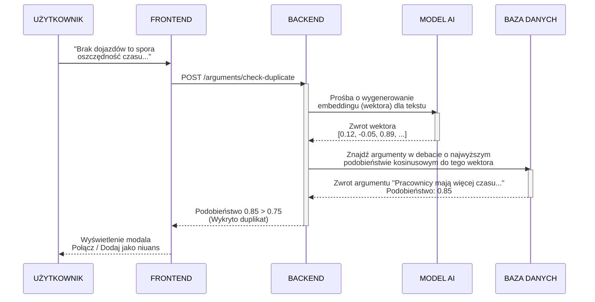

# Przepływ wykrywania powielonej przesłanki (Duplikaty)

Poniższy schemat ilustruje proces zapobiegający dodawaniu do debaty tych samych argumentów, używając wektorowej analizy tekstu.

### Szczegółowa analiza przepływu krok po kroku

#### Krok 1: UŻYTKOWNIK -> FRONTEND (Zatwierdzenie wpisanego argumentu)
- **Co się dzieje:** Użytkownik wpisuje treść swojego argumentu w pole tekstowe, a następnie **jawnie klika przycisk "Dodaj argument"** (lub wciska Enter). Aplikacja przechwytuje to zdarzenie (submit formularza) i wstrzymuje standardowy proces zapisu. Zapytanie **NIE JEST** wysyłane przy każdym naciśnięciu klawisza (to by "zabiło" serwer i wygenerowało gigantyczne koszty API) — weryfikacja następuje dopiero, gdy użytkownik skończy pisać i spróbuje wysłać formularz.
- **Dlaczego:** Aby zadbać o jakość debaty, musimy upewnić się na samym końcu procesu dodawania, że nikt przed tą osobą nie napisał już w tej sekcji grafu dokładnie tego samego.

#### Krok 2: FRONTEND -> BACKEND (POST /arguments/check-duplicate)
- **Co się dzieje:** Aplikacja kliencka wysyła na serwer żądanie zawierające wpisany przez użytkownika i gotowy do publikacji tekst.
- **Dlaczego:** Proces analizy semantycznej (znaczeniowej) jest bardzo ciężki, wymaga wektorowej bazy danych i kluczy API zewnętrznego modelu AI. Przeglądarka internetowa nie jest w stanie wykonać tego samodzielnie.

#### Krok 3: BACKEND -> MODEL AI (Prośba o wygenerowanie embeddingu)
- **Co się dzieje:** Zanim zaczniemy cokolwiek szukać, serwer uderza do zewnętrznego tzw. *Embedding API* (np. od OpenAI) z prośbą o przetłumaczenie wpisanego tekstu.
- **Dlaczego:** Klasyczne bazy danych SQL szukają podobieństwa za pomocą mechanizmu dopasowywania słów (jak `LIKE %słowo%`). Zobaczmy problem: 
  - *Tekst 1:* "Zyskujemy cenne godziny rezygnując z aut"
  - *Tekst 2:* "Brak dojazdów to ogromna oszczędność czasu"
  Baza SQL stwierdzi, że to dwa zupełnie inne zdania (0 wspólnych słów). Sztuczna inteligencja potrafi przeczytać tekst, zrozumieć jego sens i spłaszczyć go do abstrakcyjnych pojęć.

#### Krok 4: MODEL AI -> BACKEND (Zwrot wektora)
- **Co się dzieje:** AI odsyła tzw. wektor (embedding). Jest to ogromna tablica ułamków (np. 1536 liczb: `[0.12, -0.05, 0.89, ...]`). 
- **Czym są wektory?** Wyobraźmy sobie bardzo prosty model świata o tylko dwóch osiach: oś X to "Czas", oś Y to "Transport". Zdanie o oszczędności czasu na dojazdach miałoby wysokie wartości na osi X i Y. Komputer mógłby narysować punkt (wektor) reprezentujący to zdanie na wykresie. W rzeczywistości model GPT nie ma 2 osi abstrakcji, lecz np. 1536! Ten ciąg liczb to po prostu współrzędne określające, w jakim "miejscu przestrzeni znaczeń" znajduje się ta konkretna myśl użytkownika.

#### Krok 5: BACKEND -> BAZA DANYCH (Szukanie wektorów wg podobieństwa kosinusowego)
- **Co się dzieje:** Serwer przesyła ten nowo otrzymany wektor do relacyjnej bazy danych (wzbogaconej o moduł `pgvector`). Baza natychmiast porównuje nowy wektor z wektorami WSZYSTKICH innych argumentów przypisanych do tego samego rodzica w debacie.
- **Czym jest podobieństwo kosinusowe?** Ponieważ każdy tekst w naszej bazie to strzałka (wektor) wychodząca ze środka naszego 1536-wymiarowego wykresu, możemy zmierzyć kąt między dowolnymi dwiema strzałkami.
  - Jeśli strzałki pokrywają się (kąt 0 stopni), kosinus wynosi 1.0 -> teksty znaczą w 100% to samo.
  - Jeśli strzałki są prostopadłe (kąt 90 st.), kosinus to 0.0 -> teksty w ogóle nie są powiązane.
  - Jeśli strzałki są skierowane w odwrotne strony (kąt 180 st.), kosinus to -1.0 -> teksty znaczą dokładną odwrotność.

#### Krok 6: BAZA DANYCH -> BACKEND (Zwrot argumentu i jego podobieństwa)
- **Co się dzieje:** Baza odsyła pełen obiekt najbardziej podobnego argumentu wraz ze współczynnikiem dopasowania (np. 0.85). Wartość od 0 (zupełnie co innego) do 1 (identyczny tekst).
- **Dlaczego:** Baza danych robi tylko czystą matematykę — serwer musi sam zinterpretować ten wynik matematyczny według logiki biznesowej aplikacji.

#### Krok 7: BACKEND -> FRONTEND (Weryfikacja z limitem - Threshold)
- **Co się dzieje:** Backend sprawdza otrzymany współczynnik z konfigurowalnym progiem odcięcia (`DUPLICATE_THRESHOLD`, np. 0.75). Jeżeli 0.85 > 0.75, backend zgłasza "Wykryto duplikat!".
- **Dlaczego:** Musi istnieć sztywna granica, od której uznajemy, że dwa zdania są na tyle podobne, by uznać je za plagiat/powtórzenie, ale też nie zablokować komuś dodania unikalnego niuansu.

#### Krok 8: FRONTEND -> UŻYTKOWNIK (Wyświetlenie modala prewencyjnego)
- **Co się dzieje:** Frontend dostaje sygnał alarmowy i powstrzymuje ostateczne zatwierdzenie i narysowanie argumentu. Wysuwa na ekran modal (okienko popup).
- **Dlaczego:** Interwencja systemu: *"Ktoś napisał już coś bardzo podobnego. Nie zaśmiecaj dyskusji"*. Dajemy jednak użytkownikowi wyjście – zamiast dodawać nową gałąź na grafie, aplikacja sugeruje mu połączenie jego myśli w formie "Niuansu" do już istniejącego, wykrytego węzła. Utrzymuje to graf w czystości i powstrzymuje bałagan.
