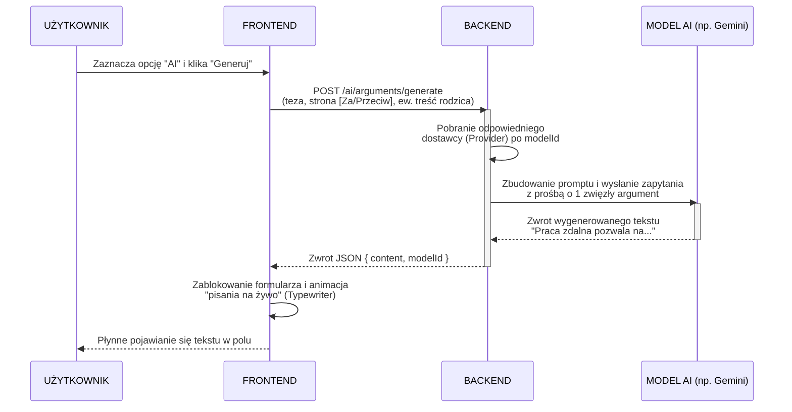

# Przepływ generacji argumentu przez AI

Poniższy diagram sekwencji przedstawia, jak działa przepływ od momentu kliknięcia przycisku przez użytkownika, aż po wypełnienie pola tekstowego wygenerowaną treścią.

### Szczegółowa analiza przepływu krok po kroku

#### Krok 1: UŻYTKOWNIK -> FRONTEND (Zaznacza opcję "AI" i klika "Generuj")
- **Co się dzieje:** Użytkownik w formularzu dodawania argumentu `AddArgumentForm.tsx` przełącza tryb na "Wsparcie AI", wybiera interesujący go model (np. Gemini) i klika przycisk generowania.
- **Dlaczego:** Aplikacja oddaje decyzyjność użytkownikowi — może napisać argument sam, albo poprosić sztuczną inteligencję o wygenerowanie myśli w oparciu o kontekst (za lub przeciw).

#### Krok 2: FRONTEND -> BACKEND (POST /ai/arguments/generate)
- **Co się dzieje:** Frontend wysyła żądanie HTTP POST. Przekazuje w nim parametry: identyfikator debaty, stronę (`pro`/`against`), identyfikator modelu, tezę oraz ewentualną treść argumentu rodzica (`parentContent`), jeśli odpowiada komuś niżej w drzewie.
- **Dlaczego:** Przekazanie tego bogatego kontekstu (szczególnie `parentContent`) jest krytyczne, by sztuczna inteligencja nie generowała ogólnikowych argumentów o głównej tezie, lecz precyzyjnie ripostowała wypowiedzi znajdujące się głęboko w drzewie dyskusyjnym.

#### Krok 3: BACKEND -> BACKEND (Pobranie odpowiedniego dostawcy po modelId)
- **Co się dzieje:** Serwer odbiera żądanie i poprzez `LlmRegistry` znajduje klasę obsługującą wybrany model (np. `GeminiProvider`).
- **Dlaczego:** Architektura aplikacji pozwala na proste podłączanie wielu modeli od różnych dostawców (OpenAI, Anthropic, Google). Wzorzec Rejestru pozwala oddelegować zadanie do właściwej biblioteki (SDK) wybranego dostawcy.

#### Krok 4: BACKEND -> MODEL AI (Zbudowanie promptu i wysłanie zapytania)
- **Co się dzieje:** Wybrany *Provider* buduje tekstowe zapytanie (prompt) dedykowane konkretnej sytuacji ("Wygeneruj argument [Za/Przeciw] powyższemu argumentowi" lub "...tej tezie"). Dodaje warunki techniczne (np. "maksymalnie 3 zdania, pisz po polsku, bez wstępu"). Tak zbudowany tekst trafia do zewnętrznego API modelu AI.
- **Dlaczego:** Modele AI łatwo popadają w tzw. "halucynacje" i lanie wody. Bardzo restrykcyjnie sformułowany prompt chroni nas przed otrzymywaniem w odpowiedzi niechcianych uśmiechów, nagłówków czy podwójnych zaprzeczeń psujących strukturę debaty.

#### Krok 5: MODEL AI -> BACKEND (Zwrot wygenerowanego tekstu)
- **Co się dzieje:** Model językowy odsyła z powrotem do serwera wygenerowaną odpowiedź tekstową.
- **Dlaczego:** Backend przetwarza tę zewnętrzną odpowiedź, mapuje ją i usuwa potencjalne błędy, by zapewnić, że do klienta trafi zawsze ustandaryzowany obiekt.

#### Krok 6: BACKEND -> FRONTEND (Zwrot JSON)
- **Co się dzieje:** Serwer wysyła przeglądarce standardową odpowiedź `200 OK` z ładunkiem JSON zawierającym wygenerowany tekst i użyty model.
- **Dlaczego:** Typowe zachowanie architektoniczne warstwy API — klient otrzymuje surowe dane, z którymi może zrobić co zechce na poziomie interfejsu użytkownika.

#### Krok 7: FRONTEND -> FRONTEND (Zablokowanie formularza i animacja Typewriter)
- **Co się dzieje:** Zamiast wklejać cały tekst natychmiast do pola edycji (`textarea`), uruchamiany jest React hook `useTypewriter`. Formularz zostaje "zamrożony" (disabled), a tekst jest stopniowo "wlewany" do pola z ustalonym opóźnieniem (np. po 20 ms na znak).
- **Dlaczego:** Natychmiastowe wyskoczenie pełnego akapitu tekstu z boku ekranu po kilkusekundowym oczekiwaniu często powoduje dyskomfort ("skok" interfejsu). Symulacja pisania na żywo wygląda naturalnie, dając użytkownikowi wrażenie, że model "myśli" i generuje tekst "w locie". Zablokowanie formularza zapobiega z kolei edytowaniu tekstu, gdy ten się jeszcze pisze, co rodziłoby dziwne konflikty UX.
