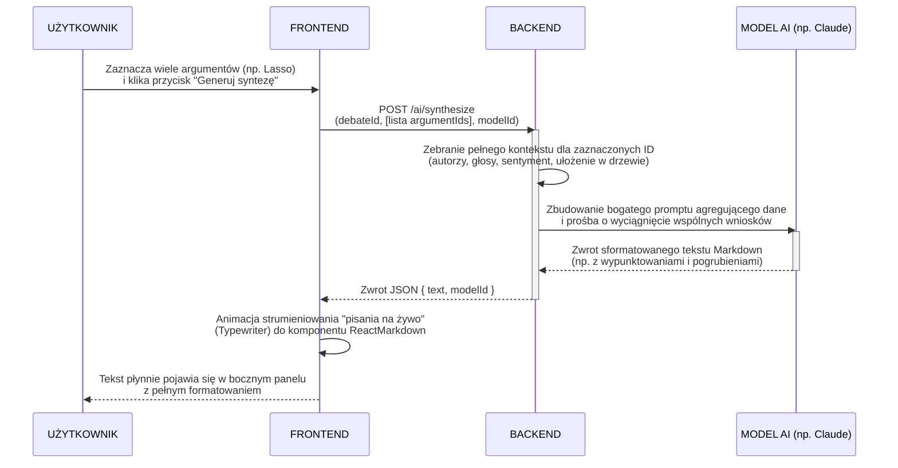

# Przepływ syntezy argumentów przez AI (Streszczenie)

Poniższy diagram sekwencji przedstawia, jak działa przepływ od momentu zaznaczenia węzłów na grafie, aż po wygenerowanie sformatowanego streszczenia przez wybrany model LLM.

### Szczegółowa analiza przepływu krok po kroku

#### Krok 1: UŻYTKOWNIK -> FRONTEND (Zaznacza argumenty i klika "Generuj syntezę")
- **Co się dzieje:** Użytkownik wykorzystuje interfejs graficzny (np. zaznaczenie obszarem/lasso) na mapie debaty, by wybrać konkretną grupę argumentów, a następnie otwiera panel boczny i uruchamia proces syntezy.
- **Dlaczego:** Pozwala to na wybiórczą analizę — użytkownik może chcieć streścić tylko konkretną "gałąź" dyskusji (np. poboczną kłótnię 3 osób o koszty prądu), a nie całą debatę zawierającą 100 węzłów.

#### Krok 2: FRONTEND -> BACKEND (POST /ai/synthesize)
- **Co się dzieje:** Aplikacja kliencka wysyła na serwer żądanie zawierające ID debaty, wybranego modelu LLM oraz tablicę (listę) samych identyfikatorów UUID zaznaczonych argumentów.
- **Dlaczego:** Frontend nie przechowuje i nie przesyła pełnych tekstów z metadanymi, bo to nieefektywne i mogłoby być podatne na manipulacje. Wysyła same "wskaźniki", zlecając serwerowi odtworzenie struktury.

#### Krok 3: BACKEND -> BACKEND (Zebranie pełnego kontekstu dla zaznaczonych ID)
- **Co się dzieje:** Backend wykonuje operację *Enrichmentu* w bazie danych. Mając tylko "suche" ID, pobiera pełne obiekty i składa je w strukturę powiązań. Pobiera informacje o tym: co powiedziano, kto to powiedział, jaka jest głębokość argumentu, jaki ma sentyment, kto komu odpowiada oraz ile lajków/dislajków zebrano w każdym z nich.
- **Dlaczego:** To absolutnie kluczowe dla jakości syntezy. Bez tego LLM dostałby tylko płaską zbitkę losowych zdań. Po wzbogaceniu danych, AI wie z jak "ciężkim" argumentem ma do czynienia (np. że dany pogląd zdobył poparcie całej społeczności, podczas gdy inny został odrzucony).

#### Krok 4: BACKEND -> MODEL AI (Zbudowanie bogatego promptu i wysłanie zapytania)
- **Co się dzieje:** Odpowiedni adapter modelu generuje zaawansowany prompt agregujący powyższe dane i precyzyjnie prosi sztuczną inteligencję o analizę trendów w tej części dyskusji oraz wyciągnięcie wspólnych wniosków.
- **Dlaczego:** Ogranicza to halucynacje i upewnia się, że model użyje profesjonalnego języka z podsumowaniem ilościowym i jakościowym. W prompcie wbudowane jest żądanie sformatowania tekstu jako Markdown (wypunktowania, pogrubienia ważnych osób/tez).

#### Krok 5: MODEL AI -> BACKEND (Zwrot sformatowanego tekstu Markdown)
- **Co się dzieje:** Model AI odsyła tekst będący odpowiedzią na polecenie. Tekst ten często zawiera znaczniki `**`, `-`, `#`.
- **Dlaczego:** Markdown jest standardem w formatowaniu tekstu z LLM. Daje estetyczne i czytelne raporty (nagłówki, listy), które łatwo później obsłużyć na frontendzie.

#### Krok 6: BACKEND -> FRONTEND (Zwrot JSON)
- **Co się dzieje:** Serwer pakuje surowy Markdown w obiekt JSON i wysyła odpowiedź `200 OK` do aplikacji klienta.
- **Dlaczego:** Pozwala to na uniwersalne konsumowanie odpowiedzi niezależnie od urządzenia (desktop, mobile).

#### Krok 7: FRONTEND -> FRONTEND (Animacja Typewriter do ReactMarkdown)
- **Co się dzieje:** Otrzymany tekst w formie całego bloku nie jest bezpośrednio "wstrzykiwany" w HTML. Uruchamiana jest pętla symulująca pisanie (hook `useTypewriter`). Literka po literce, stopniowo ujawniany tekst trafia jako zmienna (props) do komponentu `<ReactMarkdown />`, który w ułamkach sekund renderuje to na "żywego" HTMLa.
- **Dlaczego:** Streszczenia potrafią być długie (np. na całą stronę formatu A4). Gdybyśmy po 5 sekundach czekania wyrzucili użytkownikowi nagle na ekran gotową stronę A4, powstałby efekt "ściany tekstu". Animacja ułatwia śledzenie bieżącej myśli i na bieżąco formatuje nagłówki i pogrubienia (ReactMarkdown działa w czasie rzeczywistym).
